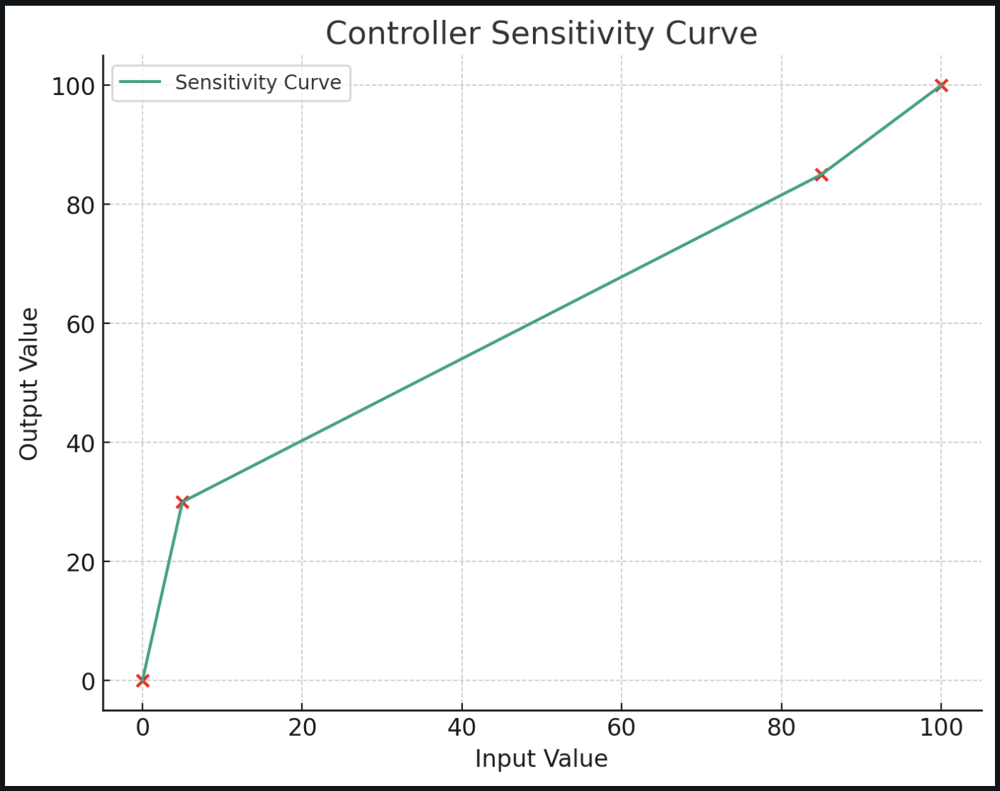

# LLG_Dev_tools

## Scripts

- LegionSpace.py: Script used to interact with the ACPI interface of the Legion GO, used to set custom mode, control TDP values, uses the same functions are Legion Space in Windows
- legion_fan_helper.py: Scripts that is meant to be ran as a service in Linux, sets a temp threshold and sets the fan speed to max to avoid thermal shutoff. This also logs the value in case of a random shutdown.
- Experiments/rumble_sim.py: This script might simulate a rumble effect, for testing or demonstration purposes.


# Legion Controller Configurator Script

This script provides a variety of commands to configure the Legion Go controller. Below is a list of available commands and their descriptions:

How to use:
```./legion_controller_configurator.py --help```

## Available Arguments

### `--touchpad-vibration`
- **Description**: Enable or disable touchpad vibration.
- **Usage**: `--touchpad-vibration True` or `--touchpad-vibration False`

### `--rgb-control`
- **Description**: Control RGB settings on the controller.
- **Usage**: `--rgb-control [CONTROLLER] [MODE] [COLOR] [BRIGHTNESS] [SPEED] [PROFILE]`
- **Example**: `--rgb-control left 1 FF0000 50 30 1`

### `--gyro-remap`
- **Description**: Set gyro remapping settings.
- **Usage**: `--gyro-remap [GYRO] [JOYSTICK]`
- **Example**: `--gyro-remap 1 2`

### `--button-remap`
- **Description**: Remap a button on the controller.
- **Usage**: `--button-remap [CONTROLLER] [BUTTON] [ACTION]`
- **Example**: `--button-remap left 1c 12`

### `--vibration-level`
- **Description**: Set the vibration level of the controller.
- **Usage**: `--vibration-level [CONTROLLER] [LEVEL]`
- **Example**: `--vibration-level right 2`

### `--fps-remap`
- **Description**: Configure FPS remapping settings.
- **Usage**: `--fps-remap [CONTROLLER] [PROFILE] [BUTTON] [ACTION]`
- **Example**: `--fps-remap left 1 1c 12`

### `--sleep-time`
- **Description**: Set the sleep time of the controller.
- **Usage**: `--sleep-time [CONTROLLER] [TIME]`
- **Example**: `--sleep-time right 15`

### `--deadzone`
- **Description**: Set the deadzone level for the controller.
- **Usage**: `--deadzone [CONTROLLER] [LEVEL]`
- **Example**: `--deadzone left 5`

### `--curve`
- **Description**: Configure the sensitivity curve of the controller.
- **Usage**: `--curve [CONTROLLER] [TX] [TY] [BX] [BY]`
- **Example**: `--curve right 85 85 5 30`

## Sensitivity Curve Example

The following graph illustrates an example sensitivity curve for the controller based on the parameters (tx=85, ty=85, bx=5, by=30):



The curve indicates how the controller's sensitivity responds across its range, providing higher sensitivity towards the higher end of the input values.
