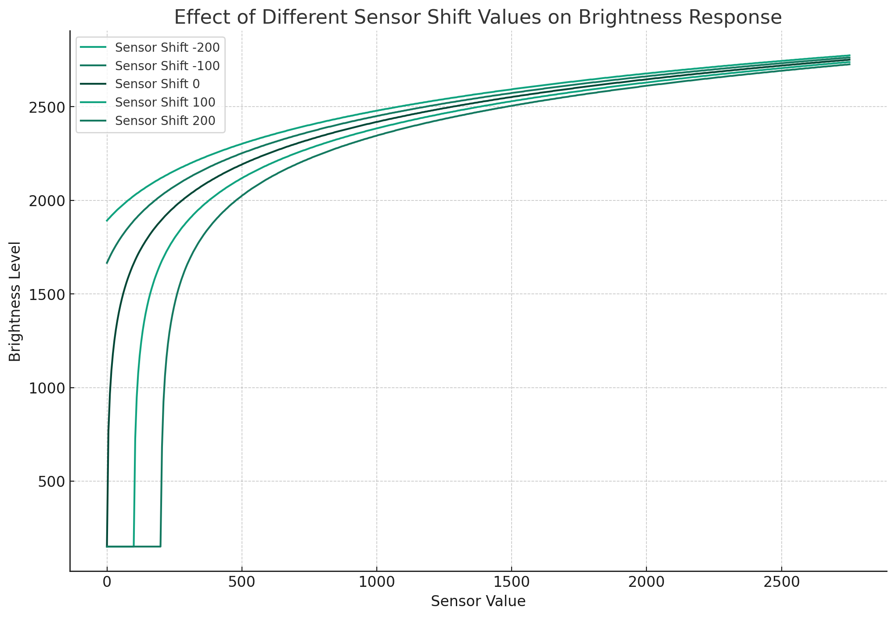
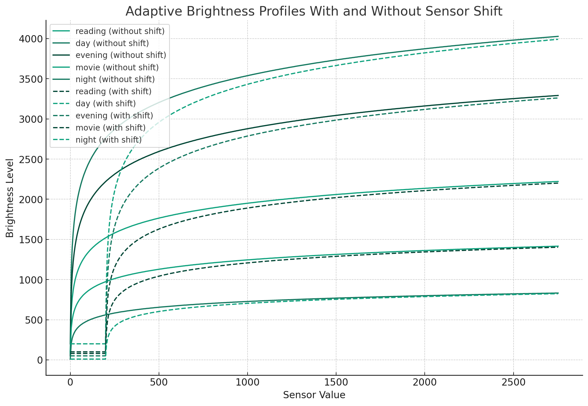

# LLG_Dev_tools

## Scripts

- legiongo_control.py: Script used to interact with the ACPI interface of the Legion GO, used to set custom mode, control TDP values, uses the same functions are Legion Space in Windows
- legion_controller_configurator.py: Script used to configure the controller, remap buttons, set deadzone, sensitivity curve, etc.
- adaptive_brightness.py: Script used to control brightness in linux, uses the ambient light sensor.
- legion_fan_helper.py: Scripts that is meant to be ran as a service in Linux, sets a temp threshold and sets the fan speed to max to avoid thermal shutoff. This also logs the value in case of a random shutdown.
- Experiments/rumble_sim.py: This script might simulate a rumble effect, for testing or demonstration purposes.


# Legion Go Control Script

This script provides various commands to control and configure the Legion Go controller. It uses specific ACPI calls for the Legion Go hardware.

## How to use

```./legiongo_control.py --help```

## Command Usage

### General Commands

#### `--set-smart-fan-mode`
- **Description**: Set the Smart Fan Mode.
- **Usage**: `--set-smart-fan-mode [value]`
- **Values**:
  - `1`: Quiet Mode (Blue LED)
  - `2`: Balanced Mode (White LED)
  - `3`: Performance Mode (Red LED)
  - `224`: Extreme Mode
  - `255`: Custom Mode (Purple LED)

#### `--get-smart-fan-mode`
- **Description**: Get the current Smart Fan Mode.
- **Usage**: `--get-smart-fan-mode`

#### `--set-tdp`
- **Description**: Set TDP value.
- **Usage**: `--set-tdp [MODE] [WATTAGE]`
- **Modes**: `Slow`, `Steady`, `Fast`

#### `--get-tdp`
- **Description**: Get TDP value for a specific mode.
- **Usage**: `--get-tdp [MODE]`
- **Modes**: `Slow`, `Steady`, `Fast`, `ALL`

#### `--set-fan-curve`
- **Description**: Set a custom fan curve.
- **Usage**: `--set-fan-curve [speeds]`
- **Example**: `--set-fan-curve 0 10 20 30 40 50 60 70 80 90 100`

#### `--set-full-speed`
- **Description**: Set fan speed to 100%, bypassing the fan curve.
- **Usage**: `--set-full-speed [1/0]`

#### `--get-fan-curve`
- **Description**: Get the current fan curve settings.
- **Usage**: `--get-fan-curve`

#### `--verbose`
- **Description**: Enable verbose logging.
- **Usage**: `--verbose`

### Specific Commands

#### `--set-deadzone`
- **Description**: Set the deadzone level for a controller.
- **Usage**: `--set-deadzone [left/right] [level]`

#### `--set-curve`
- **Description**: Set the sensitivity curve for a controller.
- **Usage**: `--set-curve [left/right] [tx] [ty] [bx] [by]`


# Legion Controller Configurator Script

This script provides a variety of commands to configure the Legion Go controller. Below is a list of available commands and their descriptions:

How to use:
```./legion_controller_configurator.py --help```

## Available Arguments

### `--touchpad-vibration`
- **Description**: Enable or disable touchpad vibration.
- **Usage**: `--touchpad-vibration True` or `--touchpad-vibration False`

### `--rgb-control`
- **Description**: Control RGB settings on the controller.
- **Usage**: `--rgb-control [CONTROLLER] [MODE] [COLOR] [BRIGHTNESS] [SPEED] [PROFILE]`
- **Example**: `--rgb-control left 1 FF0000 50 30 1`

### `--gyro-remap`
- **Description**: Set gyro remapping settings.
- **Usage**: `--gyro-remap [GYRO] [JOYSTICK]`
- **Example**: `--gyro-remap 1 2`

### `--button-remap`
- **Description**: Remap a button on the controller.
- **Usage**: `--button-remap [CONTROLLER] [BUTTON] [ACTION]`
- **Example**: `--button-remap left 1c 12`

### `--vibration-level`
- **Description**: Set the vibration level of the controller.
- **Usage**: `--vibration-level [CONTROLLER] [LEVEL]`
- **Example**: `--vibration-level right 2`

### `--fps-remap`
- **Description**: Configure FPS remapping settings.
- **Usage**: `--fps-remap [CONTROLLER] [PROFILE] [BUTTON] [ACTION]`
- **Example**: `--fps-remap left 1 1c 12`

### `--sleep-time`
- **Description**: Set the sleep time of the controller.
- **Usage**: `--sleep-time [CONTROLLER] [TIME]`
- **Example**: `--sleep-time right 15`

### `--deadzone`
- **Description**: Set the deadzone level for the controller.
- **Usage**: `--deadzone [CONTROLLER] [LEVEL]`
- **Example**: `--deadzone left 5`

### `--curve`
- **Description**: Configure the sensitivity curve of the controller.
- **Usage**: `--curve [CONTROLLER] [TX] [TY] [BX] [BY]`
- **Example**: `--curve right 85 85 5 30`

## Sensitivity Curve Example

The following graph illustrates an example sensitivity curve for the controller based on the parameters (tx=85, ty=85, bx=5, by=30):


The curve indicates how the controller's sensitivity responds across its range, providing higher sensitivity towards the higher end of the input values.


# LtChipotle's Adaptive Brightness Algorithm

This script provides adaptive brightness algorithm for the Legion Go. It allows fine-tuning of the brightness response to ambient light changes.

## Features

- Adjusts display brightness based on ambient light sensor readings.
- Customizable sensitivity and minimum brightness level.
- Smooth brightness adjustments with configurable steps.

## Usage

### Starting the Service

To start the adaptive brightness service with default or custom settings:

```bash
./adaptive_brightness.py start [OPTIONS]
```

Options

- `--min_brightness_level`: The minimum brightness level (default: 400).
- `--sensor_shift`: The curve shift (left/right) (default: -3).
- `--sensitivity_factor`: Adjusts the sensitivity to light changes (default: 1.0).
- `--step`: Step size for brightness adjustments (default: 50).
- `--silent`: Silence all logging (optional).
- `--backlight_device`: Specify the backlight device (optional).
- `--num_readings`: Number of sensor readings to average (developer only).
- `--max_sensor_value`: Maximum sensor value for scaling (developer only).

### Finding your perfect settings

A script that controls the script running in the background is provided. This script allows you to adjust the settings and see the results in real-time.

```
./helper_adaptive_brightness.py
```

Pressing `c` will print the current settings. Pressing `q` will quit the script.

For now the settings are not saved, so you will have to manually set them in the `adaptive_brightness.py` script using the `--start` command (see above).




Note that the sensor shift is the shift of the curve, not the shift of the sensor value. A negative sensor shift means that the curve is shifted to the left, and a positive sensor shift means that the curve is shifted to the right.

Adjusting sensitivity factor will shrink or grow the curve. A sensitivity factor of 1.0 means that the curve is not changed. A sensitivity factor of 0.5 means that the curve is half the size of the original curve (This means that your max brightness is halved). A sensitivity factor of 2.0 means that the curve is twice the size of the original curve, once the max brightness is reached the value is clamped.

### Pausing the Service
To pause brightness adjustments:
```
./adaptive_brightness.py pause
```
### Resuming the Service
To resume brightness adjustments:
```
./adaptive_brightness.py resume
```
### Systemd Service Integration
You can integrate this script as a systemd service for automatic start on boot.

1. Create a systemd service file (e.g., adaptive_brightness.service) with the following content:

```
[Unit]
Description=Adaptive Brightness Service
After=network.target

[Service]
Type=simple
ExecStart=/path/to/adaptive_brightness.py start --min_brightness_level 400 --sensitivity_factor 1.0 --sensor_shift -3
ExecStop=/path/to/adaptive_brightness.py pause 
ExecReload=/path/to/adaptive_brightness.py resume
User=your_username
Restart=on-failure
RestartSec=5s

[Install]
WantedBy=multi-user.target
```
2. Run the following commands to enable and start the service:
```
sudo systemctl daemon-reload
sudo systemctl enable --now adaptive-brightness.service
```
3. Control the service using:
```
sudo systemctl stop adaptive-brightness.service   # Pause
sudo systemctl start adaptive-brightness.service  # Start
sudo systemctl reload adaptive-brightness.service # Resume
```
